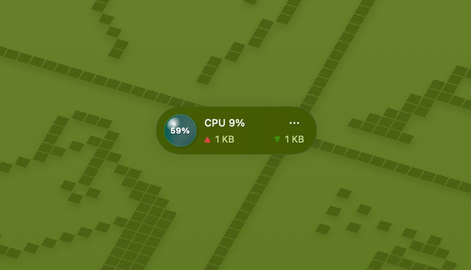

# The Speed Ball

Bring back the old 90's floating speed ball to your Mac with some how morden design.

## Preview

## Installation

This app requires macOS 15.0 or later. You can download the latest release of SpeedBall from the [App Store](https://apps.apple.com/us/app/the-speed-ball/id6746576719)

If you dont wanna buy it from App Store, you can also build it from source. In that case, this app is free.

## Features

- **CPU Monitoring** - Real-time CPU usage tracking and display
- **Memory Monitoring** - Monitor RAM usage and memory pressure
- **Network Monitoring** - Track network activity and bandwidth usage
- **Memory Cleanup** - One-click memory optimization and cleanup

## License

This project is licensed under the MIT License. See the [LICENSE](LICENSE) file for details.

---

**Copyright 2025 © Lark233. All rights reserved.**
